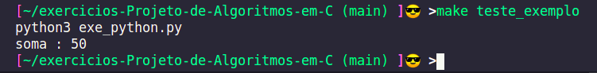

# exercicios-Projeto-de-Algoritmos-em-C
Projeto de Algoritmos (em C) Paulo Feofiloff

pricipal motivo para faze esse projeto, hobby e estudo

exercios tirados do livro:

https://www.ime.usp.br/~pf/algoritmos/idx.html

comandos usado para a compilação

```bash
    cc execicio1.c -o exem.out && ./exem.out 
```

usando make, na pasta struct

```bash
    make exemplo1  
```

Ultimamente estou estudando mais arquivos make os "makefiles", estou fazendo além de

rodar os meus códigos em C, fazendo até teste funcional, em alguns programas, muito

legal.

